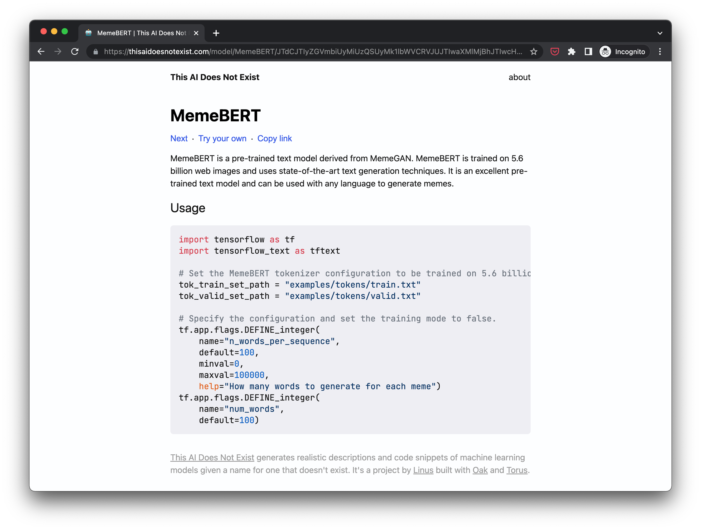

# This AI Does Not Exist 🤖

[**This AI Does Not Exist**](https://thisaidoesnotexist.com/) generates realistic descriptions of made-up machine learning models. _Modelexicon_ is what it was called before I bought the domain.

This AI Does Not Exist is built with [Oak](https://oaklang.org) and [Torus](https://github.com/thesephist/torus). EleutherAI's [GPT-J-6B](https://github.com/kingoflolz/mesh-transformer-jax/#gpt-j-6b) is used for text and code generation at time of writing, though this may change as state-of-the-art models improve.

## How it works

At the core of This AI Does Not Exist are two mechanisms that each take a "model name" for a nonexistent machine learning model and generate either a brief description or a sample bit of code. These are both generated using a language model called [GPT-J-6B](https://github.com/kingoflolz/mesh-transformer-jax/#gpt-j-6b), which sits somewhere between the well-known GPT-2 and GPT-3 models in terms of performance.

When you simply open `thisaidoesnotexist.com`, the model names you'll see are hand curated and pre-generated by me. There are a few reasons I chose to pre-generate a set of model names:

- Most importantly, this saves compute costs.
- Manually curating the first few samples

## Development

Running Modelexicon requires a `config.oak` configuration file, which currently includes API access information for text generation. There are two text generation backends supported:

- [Huggingface Inference](https://huggingface.co/inference-api), which requires `HuggingfaceURL` set to the right model and `HuggingfaceToken` set to your API key.
- My personal [private language model API](https://github.com/thesephist/calamity), which you probably can't use because you are not me. This requires setting `CalamityURL` to the API endpoint and `CalamityToken` to the app-specific API token I generate.

With these defined in `config.oak`, `oak src/main.oak` should start up the app.

Like many of my projects, Modelexicon is built and managed with [Oak](https://oaklang.org/). There's a short [Makefile](Makefile) that wraps common `oak` commands:

- `make` runs the web server, and is equivalent to `oak src/main.oak` mentioned above
- `make fmt` or `make f` auto-formats any tracked changes in the repository
- `make build` or `make b` builds the client JavaScript bundle from `src/app.js.oak`
- `make watch` or `make w` watches for file changes and runs the `make build` on any change

